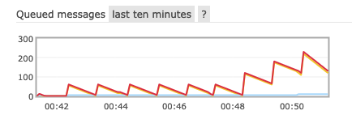
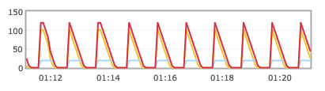

# taskui
A server that allows one to oversee tasks.
Supported task operations are:
- view all
- add one
- delete one

## Future Improvements to Make
- protect the taskui webpage with auth
- add unit tests
- turn println into logger.info
- increase the max number of connections to rabbitmq from 20 to a higher number
  - if that could not be done then: create more rabbitmq channels + hash the message id and modulo it to determine which queue to publish to
  - or switch to kafka
- use coroutines/threading in the runner so that each runner has 4 workers on it
- records running task status in redis
- have the server send the running task status to taskui webpack via polling or websockets + display that status on the page

## Load Test Results
I ran the below load test
All tasks are 5 second duration tasks

| Time | Tasks/Min | Workers |
|------|-----------|---------|
| 0:42 | 60        | 5       |
| 0:48 | 120       | 5       |
| 0:50 | 120       | 10      |
| 0:50 | 120       | 20      |
| 1:00 | 120       | 19      |




With the initial 5 workers they consumed the 60 tasks per minute of work
120 tasks per minute exceeded the capability of 5 workers
10 workers consumed the work of 120 tasks per minute but could not do the remaining queue work which hab built up
20  workers were able to do all of the queue work but crashed the task publisher because the number of max connections was exceeded
The lower plot shows 19 workers consuming 120 tasks/min and there is still extra capacity

After the load test I set the number of workers to 5 for taskrunner

## Usage
- remote: https://taskui-741f289ec720.herokuapp.com/tasks
- local: http://0.0.0.0:8080/tasks

For local usage:
- postgresql must be running and must contain the below table
- rabbitmq must be running with a queue named tasks

Local run:
```
./gradlew run
```


## Relational Db, Task Definition
Local postgresql creation
```
psql postgres
# Note: user is only for local db
CREATE USER taskrunner_readwriter WITH ENCRYPTED PASSWORD 'xfdz8t-mds-V';
CREATE DATABASE taskrunner_db WITH OWNER taskrunner_readwriter;
\c taskrunner_db taskrunner_readwriter
create table tasks (
  name varchar(255) NOT NULL PRIMARY KEY,
  filename varchar(255) NOT NULL,
  minute SMALLINT,
  hour SMALLINT
);

INSERT INTO tasks (name, filename, minute, hour) VALUES ('everyMin5sTask', 'FiveSecondTask.kt', null, null);
INSERT INTO tasks (name, filename, minute, hour) VALUES ('twoPast10sTask', 'TenSecondTask.kt', 2, null);
```

## Other Repos
- [taskpublisher](https://github.com/spacether/taskrunner_taskpublisher)
- [taskrunner](https://github.com/spacether/taskrunner_taskrunner)
